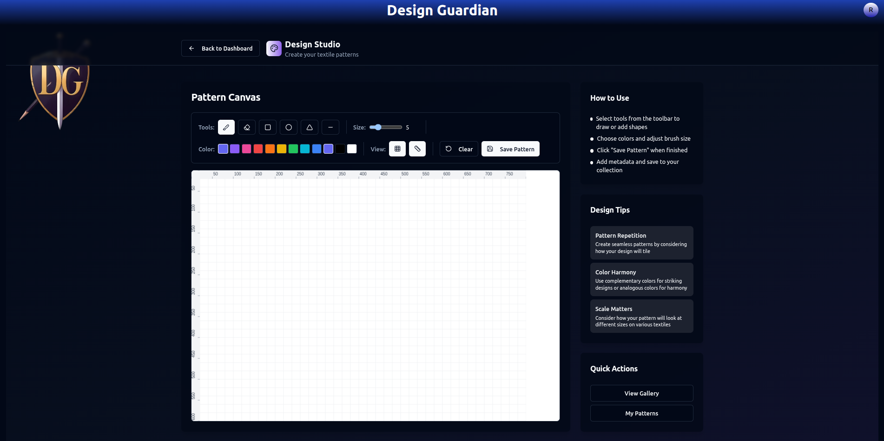
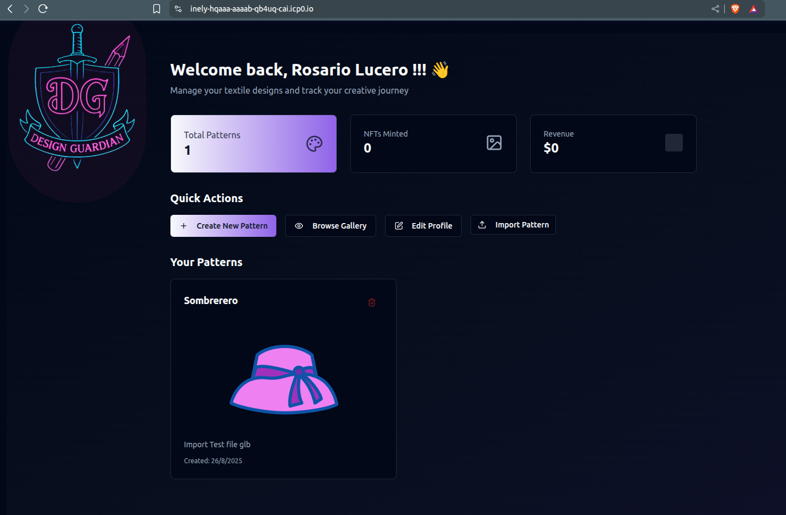

## 🧵 Project: Design Guardian
#### "Your design, your property"
##### Hackathon: WCHL25

#### [Pitch Deck](https://drive.google.com/file/d/1LZv2ckAahK4fr6-jQdiI9BN8rACOxUW_/view)
#### [Mainnet Deploy MVP](https://inely-hqaaa-aaaab-qb4uq-cai.icp0.io/)
#### [Video Demo](https://drive.google.com/file/d/19L4-Rr84E3ygQv8f29EH6D_k8AiVtHbL/view?usp=drive_link)
#### [Roadmap](./roadmap.md)

---
#### [Video National Round](https://www.youtube.com/watch?v=FYAWZYVlbvs)
#### [Video Demo National Round](https://www.youtube.com/watch?v=nzlg0kXEB38)
#### [Pitch Deck National Round](https://drive.google.com/file/d/1nq9BPgxWj14wSb9KCvjWT9dj6fp4Wmvi)
#### [Screenshots related to the progress in the 2025 WCHL National Stage](README.md#L228)

---

### 🔍 Problem Statement
Fashion designers face critical challenges in protecting and monetizing their creations:

✂️ Lack of Traceability and Verification
The absence of verifiable and permanent records prevents designers and buyers from establishing a chain of trust.
Research published by the World Intellectual Property Organization (WIPO) indicates that the fashion industry is one of the least digitized in terms of intellectual property traceability, which harms not only legal defenses against copying but also the perceived value of designs.

🧵 The Gap Between Physical and Digital
Most print-on-demand or e-commerce marketplaces operate as islands disconnected from any intellectual property registration system.
This makes the journey from creative design to the sale of physical products inefficient, opaque, and risky for designers.
Furthermore, there are no unified standards for interoperation between fashion, 3D design, and commerce platforms.

🧵 Disconnected digital-physical market: Traditional e-commerce and fashion platforms aren't connected to digital IP tools.

💸 Limited monetization options: Independent creators face technical and financial obstacles to selling or licensing their patterns globally.

---


### 💡 Proposed Solution
Design Guardian acts as a digital guardian of designers' rights, allowing them to **securely and easily** register their creations, as well as:

+ Design and save fashion designs on-platform.
+ Import and export their designs using standard formats such as DXF, SVG, PLT, PDF, and others commonly used in fashion pattern design and manufacturing.
+ View their design in a 3D simulator on garments.
+ Tokenize it as an **ICRC-7** NFT:
+ The public side of the NFT shows the **3D** rendering.
+ The private metadata contains original source files, only accessible to the NFT owner.
+ Publish or hide their NFTs in personal and global galleries.
+ Monetize through:
+ Direct sales
+ Bids
+ Usage licenses
+ Resales with built-in royalties

---

### 🎯 Goal
Empower fashion designers to create, protect, visualize and sell their work as verifiable digital assets, ensuring full control over their intellectual property and usage rights.

[Fashion show module](./goals/fashion_show.md)

[Gaming Integration](./goals/Gaming_Platform_Integration_Module.md)

---

### 🔍 Stage 1 — Clasification round — Features Breakdown

During this initial stage, Design Guardian lays the foundation for the future ecosystem by focusing on core user functionality and modular infrastructure.

#### 🧵 Core Fashion Design Workflow
- 👩‍🎨 **Designer workspace** to create fashion designs with configurable parameters.
- 💾 **Persistent saving** of work-in-progress patterns for iterative design.
- ✏️ **Design editing tools** supporting resizing, layering, coloring, and annotations.

#### 🎨 Personal Gallery
- 🖼️ Private, user-specific gallery of all designs.
- 🗂️ Sort by creation date, name, or status (draft / finalized).
- 🔒 Visibility controlled by the user (for personal use or future tokenization).

#### 👤 Profile System
- ✍️ Public nickname and bio
- 🧩 Optional metadata like email and phone (private)
- 📊 Internal dashboards with design stats (WIP, finalized, last edited)

#### 🧱 Modular Architecture for Scalability
- 🧠 Codebase prepared for future modules:
  - Tokenization
  - NFT sales
  - Chat & social features
  - Event hosting
- 🔁 Decoupled components that enable isolated updates and improvements

#### 🔐 Identity & Access Management
- 🛂 Login with Internet Identity / Plug / NFID
- 🔐 Secure ownership mapping to Principal ID
- 🧾 Smart storage permissions tied to identity

**Goal of this stage:** Validate the UX and technical core of the platform, ensuring creators can start designing, managing, and organizing their digital fashion work.

---

### 🔍 Stage 2 — National round — Features Breakdown
#### Progress Report

During this phase, the following developments and improvements were carried out:

+ Deployment of the design tokenization canister:
  + An ICRC7 canister was deployed, controlled by the platform’s main canister, responsible for managing and issuing NFTs linked to the designs.
  + Test function for NFT minting:
    A backend test function was implemented to handle NFT minting, acting as an intermediary between the user and the ICRC7 canister.

--- 
+ New features implemented in the main canister:

+ Support for multimedia-enriched comments and nested replies with a depth of up to two levels on design posts.

+ Like functionality for both designs and comments.

+ Follow system allowing users to follow designers on the platform.

---
#### Frontend
+ Design file import and 3D rendering:
  +Support for importing external design source files in GLB format was added, along with automatic 3D rendering in the frontend.
  + To enable this, an interactive 3D gallery was built using the THREE.js library, allowing users to visualize their creations once imported.


+ Rebranding and overall UI/UX improvements:
+ Aesthetic updates and visual enhancements were made to strengthen the platform’s brand identity and overall user experience.


---

## 🧩 System Components
#### 🖼️ Frontend
+ Pattern editor

+ 3D pattern simulator

+ Global and personal NFT gallery

+ Login module (Internet Identity / Plug)

+ Design board

+ Tokenization settings (visibility, license, etc.)

#### 🔐 Backend (ICP Canisters)
+ User registration module

+ Private pattern storage

+ Publishing module

+ NFT minting module (ICRC-7)

  + Licensing & royalties engine

---

### 🔄 User Flows
#### 👩‍🎨 Designer
1. Registers.
2. Starts designing.
3. Saves work in progress.
4. Tokenizes their pattern.
5. Publishes NFT to gallery.
6. NFT shows in global gallery.
7. Can hide NFT anytime.

#### 🧍 Non-designer User
1. Registers.
2. Browses global gallery.
3. Views designer profiles.
4. Buys or bids on NFTs.
5. Gains access to source files after purchase.
6. Can resell NFT (royalties to creator/platform).

---

### 🧬 Main user data
+ Owner identity (Principal)
+ Nick Name (Public)
+ Optional email (private)
+ Optional Phone (private)
+ Followeds (settable privacy)
+ Followers (settable privacy)
+ General setting

---

### ⚙️ Tech Stack (100% ICP)
#### Component	Technology
+ Backend	ICP Canisters (Motoko/Rust)
+ NFT	ICRC-7
+ Frontend	React
+ Authentication	Internet Identity / Plug / NFID
+ Storage	On-chain (ICP)
+ 3D Rendering	WebGL / Three.js

___

#### Mainnet MVP Captures
Initial view
 

Login Modal Identity provider


On login


Provisional Canva


Save Pattern modal


Saved Pattern


User Patterns


Global Galery

___
#### National stage screenshoots
* ##### 3D Gallery 


* ##### Updated dashboard

* ##### Import File Modal

* ##### Imported Design view in 3D gallery

* ##### My design

---

### Local Deploy Instructions
##### 1 Clone repository
``` sh
git clone https://github.com/Xdxsoul/design-guardian.git
cd design-guardian
```
##### 2 Install mops modules
*if not mops installed*
```sh
  npm i -g ic-mops
```
```sh
mops install
```
##### 3 Install pullable canister (internet Identity)

```sh
dfx deps pull
dfx deps init
dfx deps deploy
```
##### Deploy backend
```
cd src/design-guardian-frontend
npm run deploy
```
##### Deploy frontend
```sh
npm run build
dfx deploy frontend
```